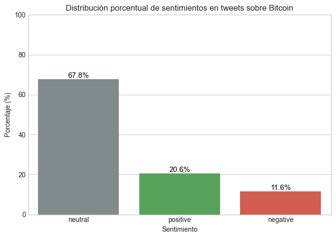
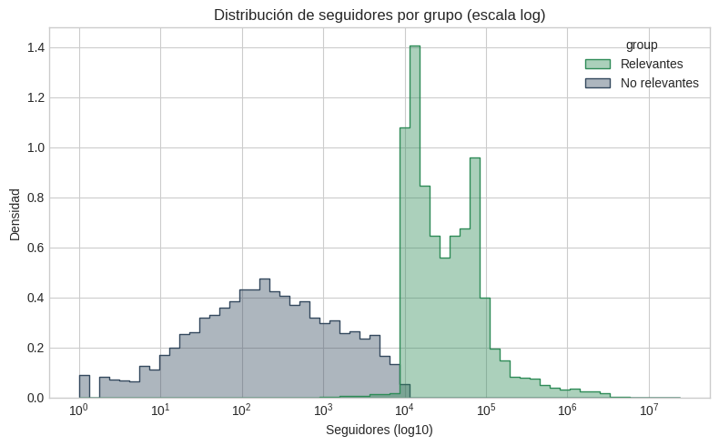
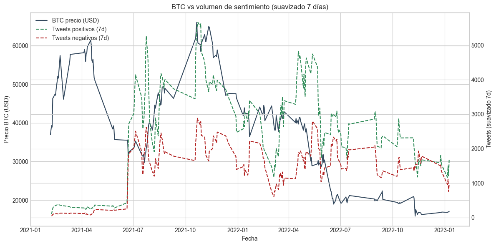

# Análisis del Impacto del Sentimiento en Twitter sobre el Precio de Bitcoin (2025)

Este repositorio contiene el trabajo de análisis realizado en el marco del proyecto de investigación desarrollado en **Projener.AI (Madrid, España)** en septiembre de 2025.

El objetivo es estudiar la relación entre el **sentimiento en Twitter** y el **precio de Bitcoin** en el periodo 2021–2023, utilizando técnicas de **Procesamiento de Lenguaje Natural (NLP)** y análisis estadístico.

---

## 📂 Estructura del repositorio

- **Notebooks/**
  - `01_sentimientos_crudos.ipynb`: Análisis inicial de la base de datos de tweets, limpieza de texto y aplicación del modelo de sentimiento (`RoBERTa`).
  - `02_analisis_financiero_10k.ipynb`: Estudio de la correlación entre sentimientos y precio de BTC utilizando tweets de usuarios con ≥10k seguidores.
  - `03_analisis_financiero_1M.ipynb`: Estudio similar, pero limitado a tweets de usuarios con ≥1M seguidores, para evaluar impacto de grandes cuentas.

- **data/**
  - `tweets_≥10k_seguidores_sentimientos.csv.gz`: Dataset procesado con resultados de sentimiento para usuarios con ≥10k seguidores.
  - `tweets_≥1M_seguidores_sentimientos.csv.gz`: Dataset procesado con resultados de sentimiento para usuarios con ≥1M seguidores.

- **PDF/**
  - `analisis_sentimientos_twitter_bitcoin.pdf`: Documento final en formato científico redactado en LaTeX.

---

## ⚙️ Tecnologías utilizadas

- **Python 3.13**  
- Librerías principales: `pandas`, `numpy`, `matplotlib`, `scikit-learn`, `transformers` (Hugging Face), `seaborn`  
- **Modelo NLP**: [`cardiffnlp/twitter-roberta-base-sentiment-latest`](https://huggingface.co/cardiffnlp/twitter-roberta-base-sentiment-latest)  
- **LaTeX**: Redacción del artículo con plantilla científica.  

---

## Metodología

1. **Recolección de datos**: tweets históricos relacionados con Bitcoin (2021–2023).  
2. **Procesamiento NLP**: tokenización y clasificación de sentimiento (positivo, negativo, neutral).  
3. **Agregación y filtrado**: análisis por grupos de usuarios (≥10k y ≥1M seguidores).  
4. **Análisis estadístico**: correlación entre sentimiento agregado y series de precios de BTC.  
5. **Visualización y discusión**: gráficos de tendencias, picos de sentimiento y comparación con episodios de volatilidad en BTC.  

---

## 📊 Resultados del estudio

Este análisis de más de **4.6 millones de tweets** demostró que el sentimiento en Twitter no siempre anticipa movimientos del mercado, pero sí ofrece señales claras en contextos de **alta volatilidad**.  

### 1. Distribución de sentimientos en Twitter
La mayoría de los tweets fueron **neutrales (67.8%)**, mientras que los positivos representaron un **20.6%** y los negativos un **11.6%**.  
Esto confirma que, aunque existen episodios de polarización, el discurso general sobre Bitcoin tiende a ser más informativo que emocional.

---

### 2. Distribución de seguidores por grupo
Al segmentar por relevancia de cuentas, se observó que la mayoría de la conversación proviene de usuarios con **más de 10k seguidores**, aunque las cuentas con **más de 1M de seguidores** tienen menor frecuencia pero mayor impacto potencial.  

---

### 3. Evolución del sentimiento vs precio de Bitcoin
La comparación entre sentimiento y precio mostró que:
- Un **optimismo persistente (3–7 días)** precede a subidas significativas.  
- En varias **caídas extremas**, el sentimiento previo era positivo, lo que indica un exceso de confianza.  
- En casos como el **colapso de FTX**, el sentimiento fue claramente negativo en los días previos, anticipando la crisis.  

---

## Principales hallazgos

- El sentimiento en Twitter no predice de forma automática el precio de Bitcoin, pero **sí ofrece señales clave en episodios de alta volatilidad**.  
- Un **sentimiento positivo persistente (3–7 días previos)** se asocia con **subidas relevantes** del precio, como ocurrió en febrero de 2021 con el anuncio de Tesla.  
- En varias **caídas extremas**, el ambiente previo era optimista, lo que muestra que la confianza excesiva puede anteceder desplomes inesperados (ej. enero de 2022 con la Reserva Federal).  
- El **colapso de FTX en noviembre de 2022** fue anticipado: el sentimiento en Twitter ya era mayoritariamente negativo en los días previos.  
- En conjunto, Twitter funciona como un **termómetro social del mercado**, capaz de reflejar y, en algunos casos, anticipar los episodios más críticos de Bitcoin.  

---

## Autoría

Trabajo realizado por **Katherine López Ramírez**  
Para **Projener.AI – Madrid, España**  
Septiembre, 2025 

---

## Licencia

Este proyecto está bajo la **Licencia MIT**.    
Copyright (c) 2025 Katherine López Ramírez
